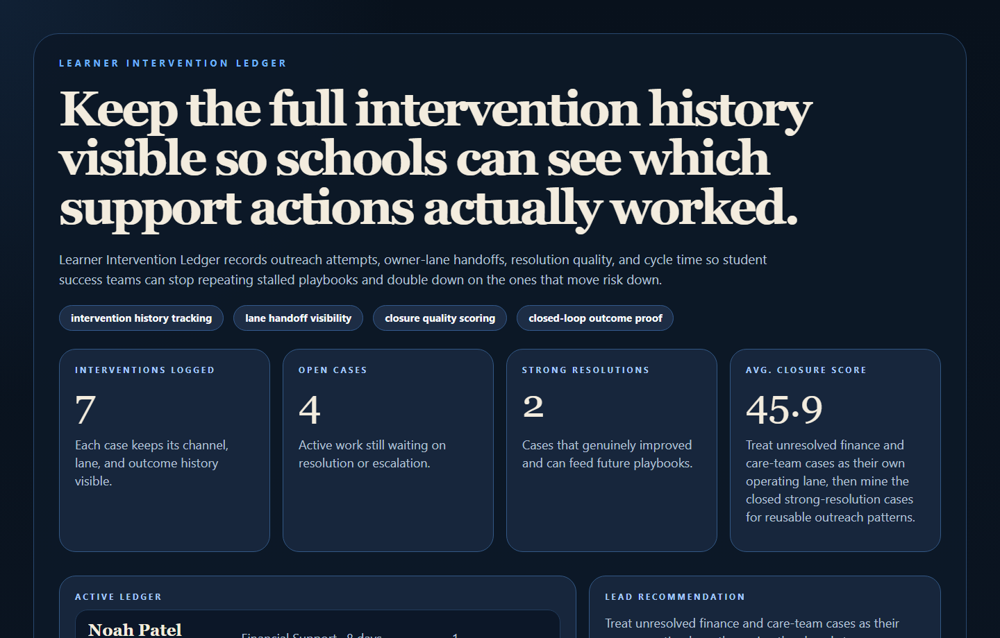
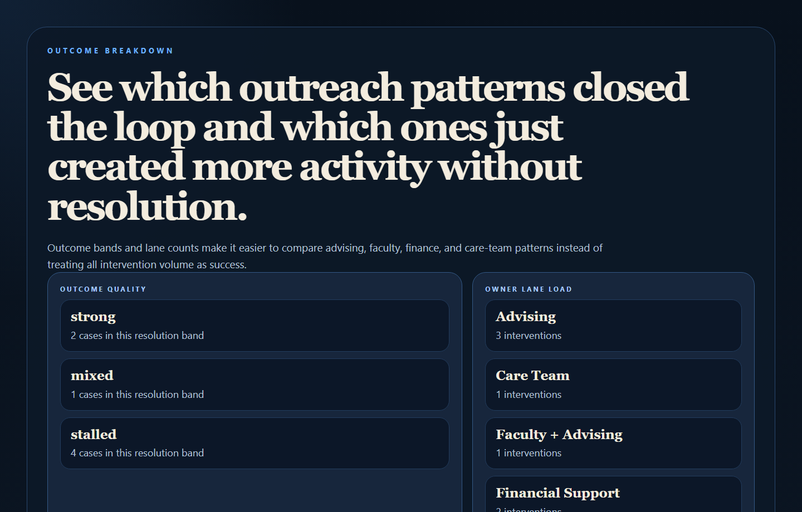
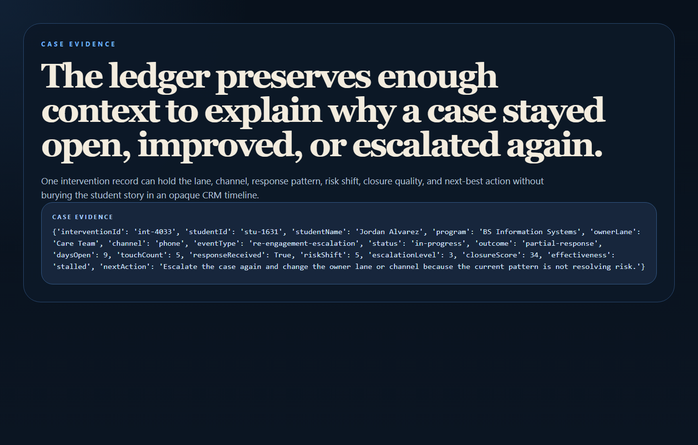
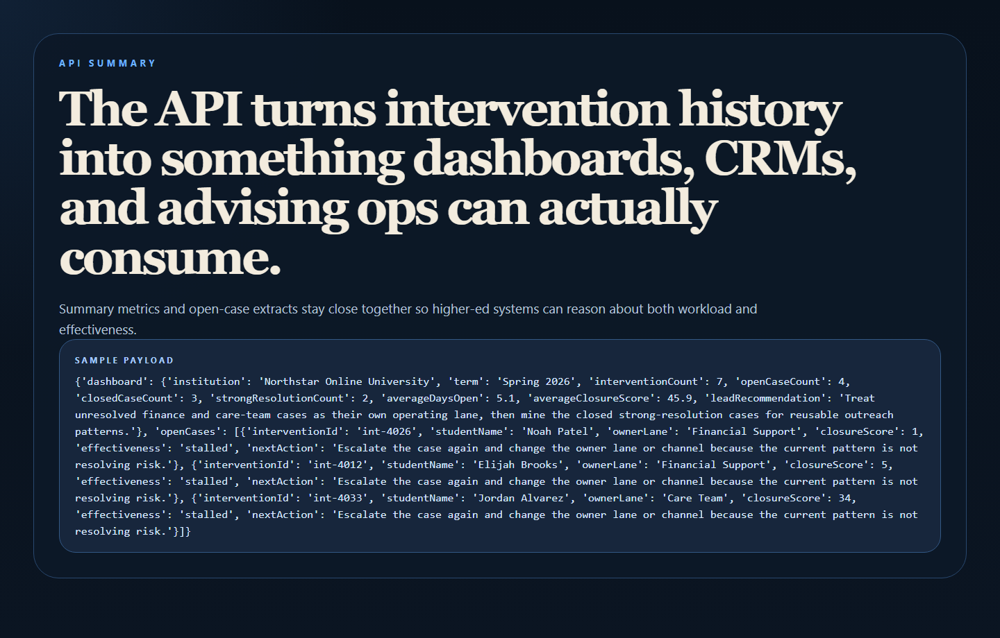

# Learner Intervention Ledger

Learner Intervention Ledger is an EdTech workflow and audit layer for student success operations. It records outreach attempts, lane handoffs, channel history, resolution quality, and cycle time so institutions can see which interventions actually improved outcomes.



## Why this repo is good

- It completes the EdTech action cluster after `student-success-signal-hub`, `curriculum-knowledge-graph`, and `advisor-outreach-orchestrator`.
- It adds auditability and outcome quality instead of only queue scoring.
- It gives schools a cleaner closed-loop view of what happened after support teams acted.

## What it does

- Logs interventions with owner lanes, channels, event types, and response state.
- Scores closure quality from response, risk movement, touch count, age, and escalation depth.
- Shows which lanes and playbook patterns are resolving cases versus stalling them.
- Exposes both an operator-facing proof surface and a clean API.

## Proof





## Local run

```powershell
Set-Location "C:\Users\chaus\dev\repos\learner-intervention-ledger"
py -3.11 -m venv .venv
.\.venv\Scripts\python.exe -m pip install -r requirements.txt
.\.venv\Scripts\python.exe -m app.main
```

Open:

- `http://127.0.0.1:4741/`
- `http://127.0.0.1:4741/outcomes`
- `http://127.0.0.1:4741/evidence`
- `http://127.0.0.1:4741/docs`

## Validation

```powershell
.\.venv\Scripts\python.exe -m unittest discover -s tests
.\.venv\Scripts\python.exe scripts\run_demo.py
.\.venv\Scripts\python.exe scripts\smoke_check.py
.\.venv\Scripts\python.exe scripts\render_readme_assets.py
```

## API shape

Endpoints:

- `/api/dashboard/summary`
- `/api/interventions`
- `/api/lanes`
- `/api/outcomes`
- `/api/interventions/{intervention_id}`
- `/api/sample`

## Repo layout

```text
app/
  data/
  services/
docs/
scripts/
screenshots/
tests/
```
